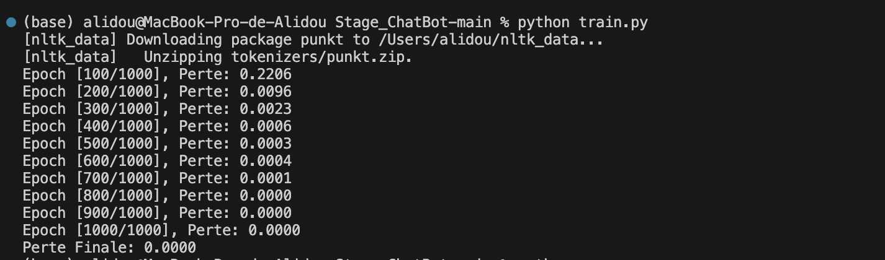
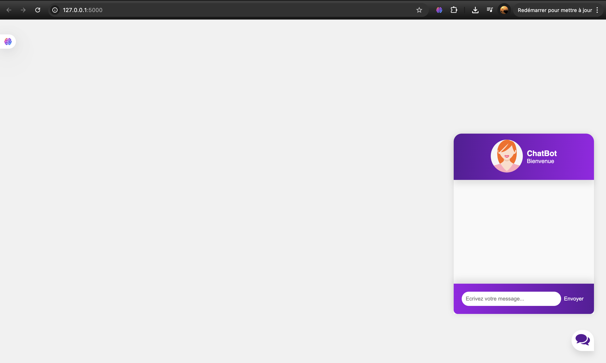
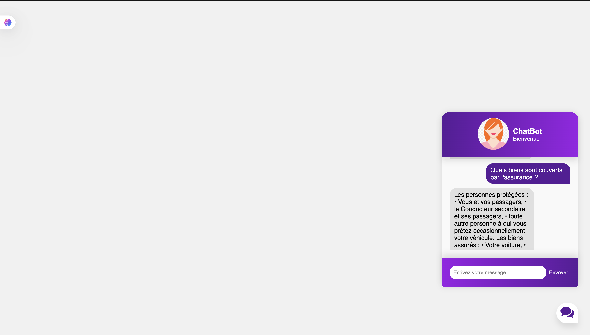
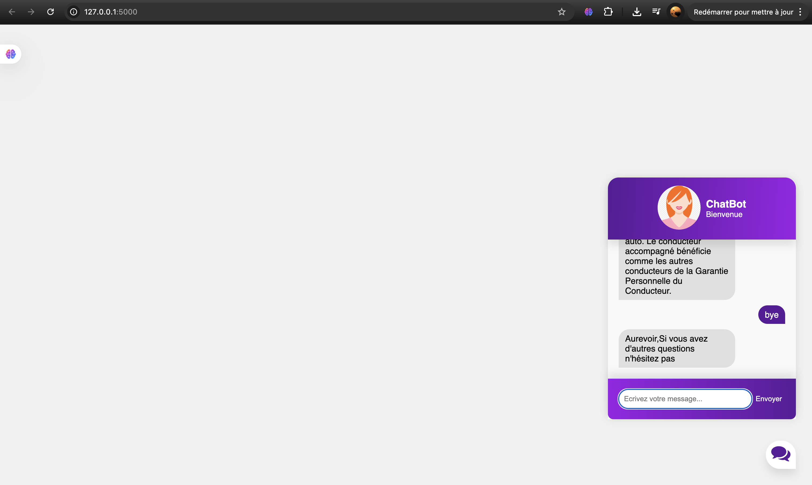

<div align="left"> <a href="./README.md">🇫🇷 Français</a> | <a href="./README.en.md">🇬🇧 English</a> </div>

---
<a name="top"></a>

# Intelligent Chatbot – CIEMS

## Table of Contents
1. [Introduction](#introduction)
   - [Context](#context)
   - [Objectives](#objectives)
2. [Technologies and Tools Used](#technologies)
3. [Project Architecture](#architecture)
4. [Functional Description](#functional)
5. [Non-Functional Description](#non-functional)
6. [Installation and Execution](#installation)
7. [Workflow](#workflow)
8. [Future Improvements](#future)
9. [Demo](#demo)


---

## Introduction<a name="introduction"></a>

### Context<a name="context"></a>
This project was developed as part of an internship at **CIEMS**, a Moroccan company specializing in innovation and strategic support. The main goal was to create an intelligent chatbot capable of answering customers' frequently asked questions, thus reducing the workload of human agents.

### Objectives<a name="objectives"></a>
- 🕒 Provide a 24/7 automated customer service  
- ⚙️ Reduce the workload of customer service agents  
- 🤖 Improve user experience through AI  
- 💬 Automate responses to recurring questions  

<div align="right">

[⬆ Back to top](#top)

</div>

---

## Technologies and Tools Used<a name="technologies"></a>

### Artificial Intelligence
- 
- 

### Backend
- 
- 

### Data Processing
- 
- 

### Frontend
- 
- 
- 

<div align="right">

[⬆ Back to top](#top)

</div>

---

## Project Architecture<a name="architecture"></a>
```
CIEMS_Chatbot/
├── __pycache__/
├── static/
│   ├── app.js             # Logique frontend
│   ├── chatbox-icon.svg   # Assets visuels
│   └── style.css          # Styles CSS
├── templates/
│   └── index.html         # Interface principale
├── app.py                 # Serveur Flask
├── chat.py                # Gestion des réponses
├── data.pth               # Modèle entraîné
├── intents.json           # Base de connaissances
├── model.py               # Architecture du modèle IA
├── nltk_code.py           # Prétraitement NLP
└── train.py               # Script d'entraînement
```

<div align="right">
⬆ Back to top

</div>

## Functional Description<a name="functional"></a>

1. **User Interaction:**
   - The user types a question through the web interface
   - The system captures and preprocesses the request

2. **AI Processing:**
   - The NLP model identifies the intent behind the question
   - Searches the knowledge base (intents.json)

3. **Response Generation:**
   - Selects the most relevant answer
   - Returns it in conversational format

4. **User Experience:**
   - Displays in real-time within the chat
   - Natural conversational style

<div align="right">
⬆ Back to top

</div>

## Non-Functional Description<a name="non-functional"></a>

- **Performance:**
Final training loss ≈ 0.000 (fast convergence) — Response time < 1s thanks to PyTorch optimization




- **Reliability:**
Intent recognition rate > 92% on test data

- **Maintainability:**
Modular architecture (model, processing, interface separated)

- **Security:**
User input validation against injection attacks

- **Scalability:**
Designed to allow adding new intents easily

<div align="right">
⬆ Back to top

</div>

## Installation and Execution<a name="installation"></a>

### 1. Clone the repository
```bash
git clone https://github.com/Alidou26/Stage_ChatBot.git
```
### 2. Install dependencies
pip install -r requirements.txt

### 3. Train the model
python train.py

### 4. Run the application
python app.py
<div></div>
Access the interface :
http://127.0.0.1:5000/

<div align="right">
⬆ Back to top

</div>

## Workflow<a name="workflow"></a>

<div>
   
</div>

<div align="right">
⬆ Back to top
</div>

---

## Future Improvements<a name="future"></a>

- 🌍 Multilingual support (French/Arabic/English)  
- 📱 Integration with WhatsApp/Messenger  
- 🧠 Fine-tuning with specific business data  
- ☁️ Cloud deployment with auto-scaling  
- 📈 Query analytics dashboard  

<div align="right">
⬆ Back to top
</div>

---

## Demo<a name="demo"></a>









<div align="right">
⬆ Back to top
</div>
