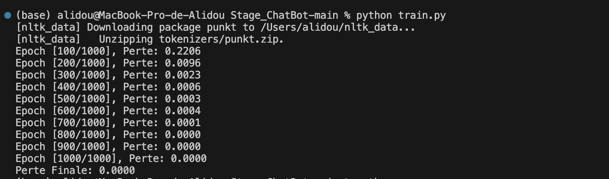
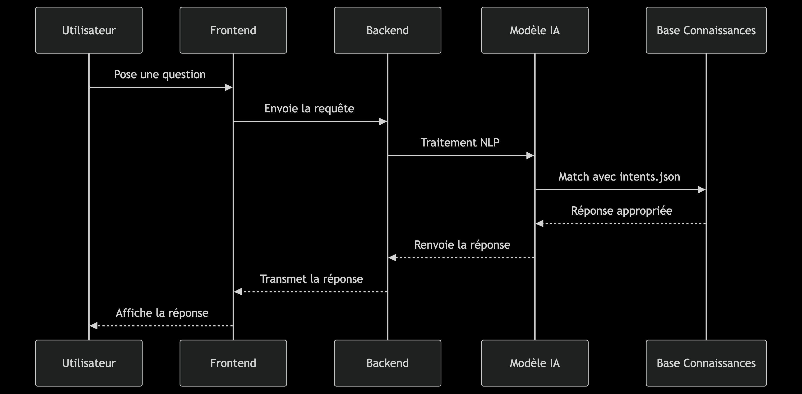
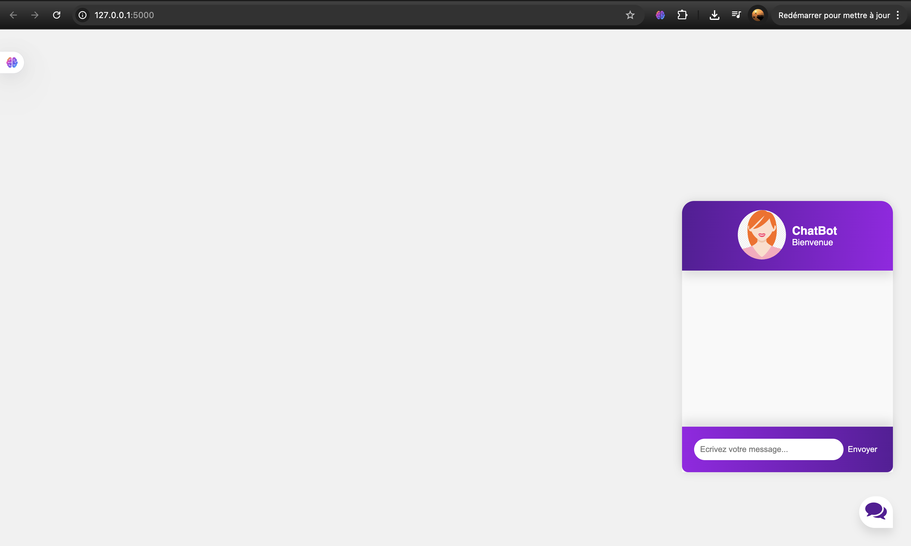
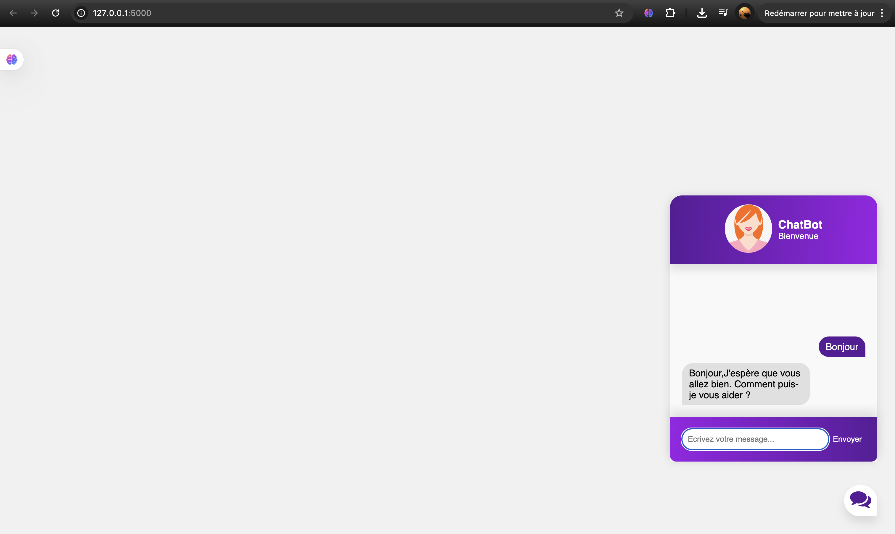
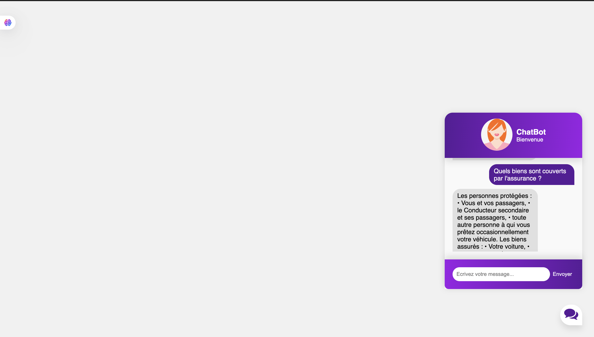
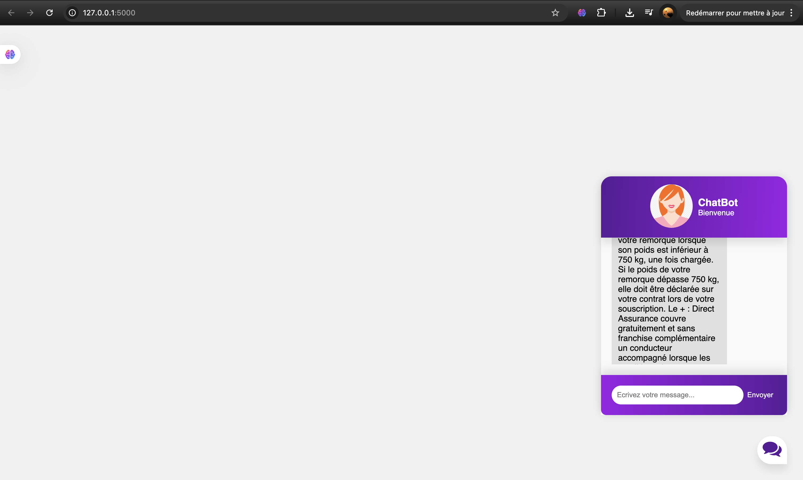
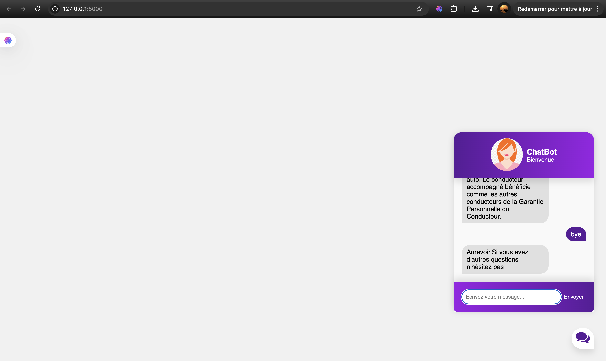

<div align="left"> <a href="./README.md">🇫🇷 Français</a> | <a href="./README.en.md">🇬🇧 English</a> </div>

---
<a name="top"></a>

# Chatbot Intelligent – CIEMS

## Table des Matières
1. [Introduction](#introduction)
   - [Contexte](#contexte)
   - [Objectifs](#objectifs)
2. [Technologies et Outils Utilisés](#technologies)
3. [Architecture du Projet](#architecture)
4. [Description Fonctionnelle](#fonctionnelle)
5. [Description Non-Fonctionnelle](#non-fonctionnelle)
6. [Installation et Exécution](#installation)
7. [Flux de Fonctionnement](#flux)
8. [Améliorations Futures](#ameliorations)
9. [Démo](#demo)


---

## Introduction<a name="introduction"></a>

### Contexte<a name="contexte"></a>
Ce projet a été développé dans le cadre d'un stage au sein de **CIEMS**, entreprise marocaine spécialisée dans l'innovation et l'accompagnement stratégique. L'objectif principal était de créer un chatbot intelligent capable de répondre aux questions fréquentes des clients, réduisant ainsi la charge des conseillers humains.

### Objectifs<a name="objectifs"></a>
- 🕒 Fournir un service client automatisé disponible 24/7  
- ⚙️ Réduire la charge de travail des conseillers  
- 🤖 Améliorer l'expérience utilisateur grâce à l'IA  
- 💬 Automatiser les réponses aux questions récurrentes  

<div align="right">

[⬆ Back to top](#top)

</div>

---

## Technologies et Outils Utilisés<a name="technologies"></a>

### Intelligence Artificielle
- 
- 

### Backend
- 
- 

### Traitement de Données
- 
- 

### Frontend
- 
- 
- 

<div align="right">

[⬆ Back to top](#top)

</div>

---

## Architecture du Projet<a name="architecture"></a>
```
CIEMS_Chatbot/
├── __pycache__/
├── static/
│   ├── app.js             # Logique frontend
│   ├── chatbox-icon.svg   # Assets visuels
│   └── style.css          # Styles CSS
├── templates/
│   └── index.html         # Interface principale
├── app.py                 # Serveur Flask
├── chat.py                # Gestion des réponses
├── data.pth               # Modèle entraîné
├── intents.json           # Base de connaissances
├── model.py               # Architecture du modèle IA
├── nltk_code.py           # Prétraitement NLP
└── train.py               # Script d'entraînement
```

<div align="right">
⬆ Back to top

</div>

## Description Fonctionnelle<a name="fonctionnelle"></a>

1. **Interaction Utilisateur :**
   - L'utilisateur saisit sa question via l'interface web
   - Le système capture et pré-traite la requête

2. **Traitement IA :**
   - Le modèle NLP identifie l'intention derrière la question
   - Recherche dans la base de connaissances (intents.json)

3. **Génération de Réponse :**
   - Sélection de la réponse la plus pertinente
   - Renvoi au format conversationnel

4. **Expérience Utilisateur :**
   - Affichage en temps réel dans le chat
   - Format conversationnel naturel

<div align="right">
⬆ Back to top

</div>

## Description Non-Fonctionnelle<a name="non-fonctionnelle"></a>

- **Performance :**
Perte d'entraînement finale ≈ 0.000 (convergence rapide) — Temps de réponse  < 1s grâce à l'optimisation PyTorch




- **Fiabilité :**
Taux de reconnaissance d'intentions > 92% sur données de test

- **Maintenabilité :**
Architecture modulaire (modèle, traitement, interface séparés)

- **Sécurité :**
Validation des entrées utilisateur contre les injections

- **Évolutivité :**
Conception permettant l'ajout de nouvelles intentions

<div align="right">
⬆ Back to top

</div>

## Installation et Exécution<a name="installation"></a>

### 1. Cloner le dépôt
git clone https://github.com/Alidou26/Stage_ChatBot.git

### 2. Installer les dépendances
pip install -r requirements.txt

### 3. Entraîner le modèle
python train.py

### 4. Lancer l'application
python app.py
<div></div>
Accéder à l'interface :
http://127.0.0.1:5000/

<div align="right">
⬆ Back to top

</div>

## Flux de Fonctionnement<a name="flux"></a>

<div>
   
</div>
<div align="right">
⬆ Back to top

</div>

## Améliorations Futures<a name="ameliorations"></a>

- 🌍 Support multilingue (français/arabe/anglais)

- 📱 Intégration avec WhatsApp/Messenger

- 🧠 Fine-tuning avec des données métier spécifiques

- ☁️ Déploiement cloud avec scaling automatique

- 📈 Tableau de bord d'analytique des requêtes

<div align="right">
⬆ Back to top

</div>

## Démo<a name="demo"></a>







<div align="right">
⬆ Back to top

</div>
